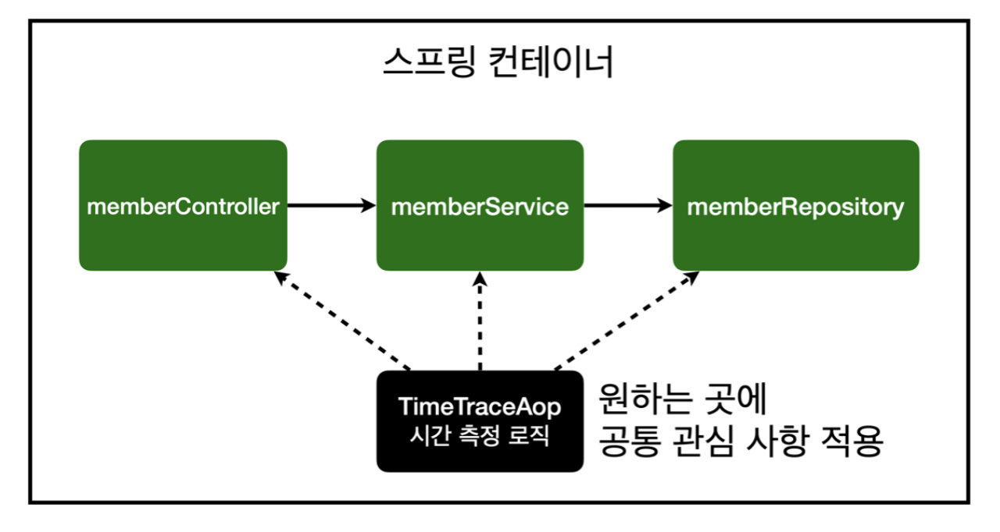
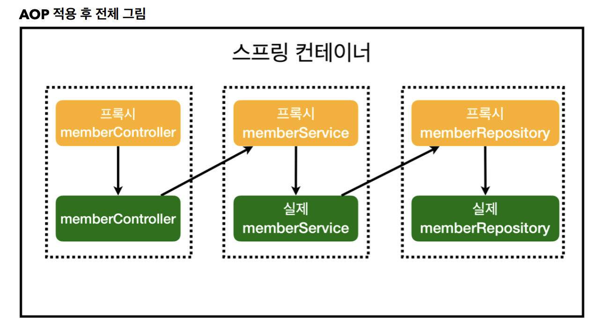

참고 강의:https://www.inflearn.com/roadmaps/373 

## AOP

## AOP가 필요한 상황

- 모든 메소드의 호출 시간을 측정하고 싶을때
- 공통 관심사항 VS 핵심 관심 사항
- 회원가입 시간, 회원조회 시간을 측정하고 싶다면?
- 시간을 측정하는 기능은 핵심 관심 사항이 아니다.
    - 시간 측정 로직은 공통 관심 사항이다.
    - 시간 측정 로직은 핵심 비즈니스 로직과 섞여서 유지보수가 어렵다.
    - 시간 측정 로직은 별도의 공통 로직으로 만들기 어렵다.
    - 시간 측정 로직은 변경할 때 모든 로직을 찾아가면서 변경해야 한다.

### AOP란?

- AOP: Aspect Oriented Programming
- 공통 관심 사항과 핵심 관심 사항을 분리가 목적
    
    
    

### AOP 적용

- `@Aspect` 어노테이션을 클래스에 추가해야한다.
- `@Around()` 어노테이션을 통해 적용하고자 하는 패키지나 파일등을 지정할 수 있다.
- `@Component` 어노테이션으로 컴포넌트 스캔 방식으로 등록을 하거나`@Bean` 을 등록해도 된다.
    - **다만 `@Bean`  을 사용하는 경우 순환참조 문제가 발생할 수 있는데 그 이유는 `@Around` 로 지정하는 범위에 AOP를 생성(SpringConfig)하는 코드가 있을 때에 발생한다. (AOP를 사용해서 자기자신을 생성하는건 말이 안된다.)**
    - @Around에서 범위를 지정할 때 해당 파일은 사용하지 않도록 하면 괜찮다

- `joinPoing.proceed()` 실제 구현부가 실행된다.